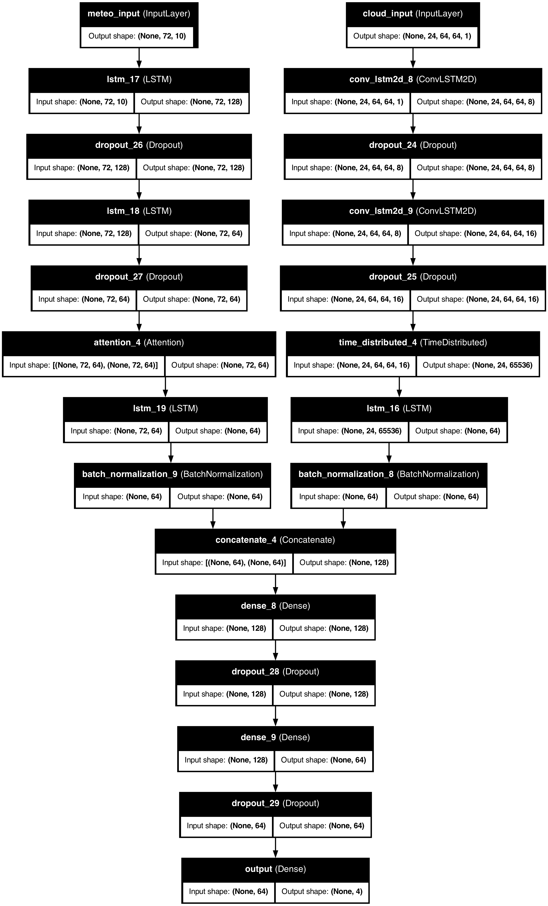

# Meteorological and Satellite-Based Precipitation Prediction

## Objective
Classify precipitation into four categories (**No Rain**, **Light Rain**, **Medium Rain**, and **High Rain**) by fusing:
1. **Meteorological (tabular time-series) data**  
2. **Satellite imagery** from GOES data

Experiment with model architectures ranging from baseline RNNs to hybrid deep-learning models (e.g., ConvLSTM2D + LSTM).

---

## Notebooks Overview

1. **Notebook 0**: Data Preparation for Inference  
   - Prepares test data for model predictions
   - Formats meteorological features and satellite images

2. **Notebook 1**: Inference & Evaluation  
   - Loads trained models for prediction
   - Calculates accuracy, F1-score, and confusion matrices

3. **Notebook 2**: Exploratory Data Analysis  
   - Analyzes satellite image characteristics
   - Visualizes data distributions and temporal patterns

4. **Notebook 3**: Data Preprocessing  
   - Handles missing values and resizes images (64×64)
   - Creates precipitation categories and sliding windows

5. **Notebook 4**: Baseline RNN Model  
   - LSTM-based model using only meteorological data

6. **Notebooks 5-12**: Hybrid Models  
   - Combine LSTM (meteorological) and ConvLSTM2D (satellite) branches
   - Test 24H/48H/72H windows with automatic/manual weight fusion

---

## Hybrid Model Architecture

### Key Components:
1. **Meteorological Branch**
   - Input: `(None, T, 10)` (10 features over T time steps)
   - Stacked LSTMs with dropout
   - Attention layer for temporal focus
   - Batch normalization

2. **Satellite Branch**
   - Input: `(None, T, 64, 64, 1)` (64×64 grayscale images)
   - ConvLSTM2D layers for spatiotemporal features
   - Time-distributed convolutions
   - Feature flattening and LSTM

3. **Fusion & Output**
   - Concatenate both branches
   - Dense layers with dropout
   - Softmax output (4 classes)

---

## Results

### Performance Summary
| Model Type              | Window Size | Weight Fusion | Accuracy | F1-Score |
|-------------------------|-------------|---------------|----------|----------|
| Baseline RNN            | -           | -             | 66%      | 0.64     |
| Hybrid                  | 24H         | Auto          | 69%      | 0.67     |
| Hybrid                  | 24H         | Manual        | 70%      | 0.68     |
| Hybrid                  | 48H         | Auto          | 73%      | 0.72     |
| Hybrid                  | 48H         | Manual        | 74%      | 0.73     |
| Hybrid (Best)           | 72H         | Manual+Extended| 77%     | 0.76     |

**Key Insight**: 72-hour models with manual weight fusion and extended training achieved the best performance, showing 11% absolute improvement over baseline.

---

## Team
- Lokesh Balamurugan (Model Architecture)
- Nitin Sai Varma Indukuri (Data Pipeline)
- Krishica Gopalakrishnan (Evaluation Framework)

---

## Contact
For collaboration or inquiries:
- **Email**: ml-weather-team@university.edu  
- **GitHub**: [Lake-Michigan-Precipitation](https://github.com/yourorg/Lake-Michigan-Precipitation)

> **Acknowledgments**: NOAA for meteorological data and GOES satellite imagery.
